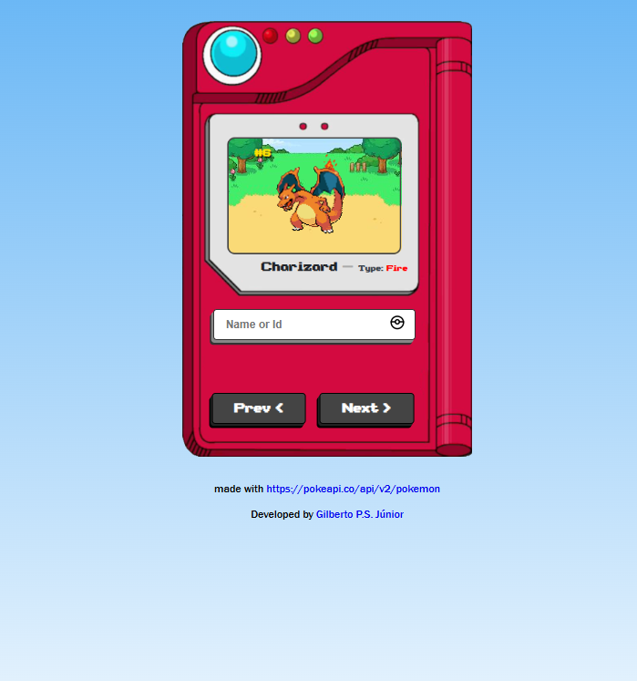

# 🧩 Pokédex Dinâmica

Uma Pokédex interativa construída com HTML, CSS e JavaScript puro (Vanilla JS).  
Consome dados em tempo real da [PokéAPI](https://pokeapi.co/) e exibe cards com informações dos Pokémon.

---

## 🚀 Tecnologias utilizadas

- HTML5
- CSS3
- JavaScript (ES6)
- Fetch API
- PokéAPI (API pública)

---

## 📸 Imagem do Projeto

> 🎮 Tela com cards dos Pokémon carregados da API



---

## 🧠 Funcionalidades

✅ Consumo de API pública (PokéAPI)  
✅ Exibição dinâmica de vários Pokémon  
✅ Interface responsiva com CSS puro  
✅ Imagens, nomes, tipos e outros dados básicos  
✅ Pesquisa por nomes ou numeros da pokedex

---

## 📦 Como rodar o projeto localmente

1. Clone o repositório:
```bash
git clone https://github.com/Gilberto-psJunior/Pokedex_dinamico.git
